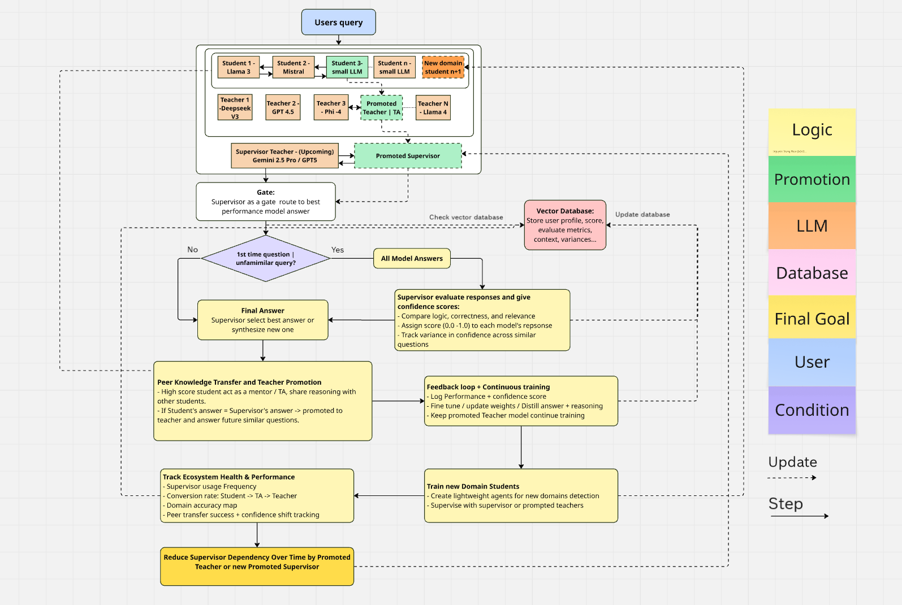

# A Self-Evolving Teacher-Student Architecture for Scalable and Cost-Efficient LLM Systems

**Author:** Nguyen Trung Hieu  
**Date:** 9th May 2025  
**Email:** hieuhip4444@gmail.com  
**LinkedIn:** [linkedin.com/in/hieu-nguyen-b0834b154](https://linkedin.com/in/hieu-nguyen-b0834b154)  
**GitHub:** [github.com/sidataba/LLMs–Self-Evolving-Teacher-Student-Architecture](https://github.com/sidataba/LLMs–Self-Evolving-Teacher-Student-Architecture)

---

## 🧠 Abstract

This project proposes a modular, self-improving architecture for deploying LLMs in a cost-efficient and scalable manner. The system coordinates a cluster of student and teacher models under a supervisory LLM. It dynamically learns from performance, promotes capable models, and delegates tasks based on domain expertise and confidence scores. A shared vector database stores user profiles, queries, and metrics to inform routing. The ecosystem evolves over time—specializing, transferring knowledge, and reducing reliance on expensive generalist models.

---

## 1. 📌 Context and Motivation

LLMs like GPT-4.5 or Gemini 2.0 Flash are powerful but costly and difficult to fine-tune for specialized use cases. This makes domain adaptation inaccessible to smaller labs and teams.

As a self-taught researcher with experience in data-driven work, I believe that sustainable AI requires cost-efficient, collaborative learning frameworks. This project proposes a system where lightweight, specialized agents evolve over time—learning from feedback, peers, and a supervisory model.

---

## 2. ⚙️ Architecture Overview

- **Supervisor LLM:** Generalist model (e.g. GPT-5 / Gemini 2.5 Pro) that manages routing and evaluation.
- **Teachers & Students:** Specialized models (open or small-scale) assigned per domain or learning phase.
- **Vector Database:** Stores query embeddings, profiles, response scores, and historical performance.

**Query Flow:**

1. **New Query:**  
   - Query embedding is checked against the vector DB.  
   - If novel → all models answer in parallel.  
   - If similar → routed to the best past performer (typically a teacher).

2. **Evaluation:**  
   - Supervisor assigns confidence scores.  
   - Best response selected or synthesized.  
   - Students learn from winning response.  

3. **Promotion & Learning:**  
   - High-performing students become TAs or teachers.  
   - System gradually reduces reliance on supervisor.

---

## 3. 🖼️ System Diagram
Here is the Diagram of system's Architecture
  

---

## 4. 🧩 Key Components

### A. Query Processing & Vector Database
- Store user profiles, past queries, domain stats.
- Use vector similarity to identify familiar vs. novel questions.

### B. All Models Answer in Parallel (Novel Queries)
- Students, teachers, and supervisor all answer.
- Supervisor compares logic, relevance, and correctness.
- Each answer scored with confidence (0.0–1.0).

### C. Smart Routing for Repeat Queries
- Supervisor routes to best historical performer (typically a teacher).
- Some students also receive the query for continued learning.
- Optimized for cost efficiency.

### D. Final Answer Selection
- Supervisor selects or synthesizes from all inputs.
- Prioritizes students if their answers match or surpass supervisor quality.

### E. Feedback Loop & Fine-Tuning
- All models receive feedback:
  - Confidence scores
  - Comparison of reasoning paths
  - Distilled answers from winner
- Used to improve models via distillation or fine-tuning (if weights available).

### F. Peer Knowledge Transfer & Promotion
- Top students become TAs or mentors.
- Share reasoning chains and outputs.
- If consistently strong → promoted to Teacher.

### G. Train New Domain Students
- Lightweight models introduced for uncovered domains.
- Supervised by teachers or supervisor.
- Must pass quality checks before being active.

### H. Ecosystem Monitoring
- Track student → TA → teacher promotion.
- Supervisor usage frequency.
- Domain-wise accuracy maps.
- Peer learning effectiveness.

### I. Reduce Supervisor Role
- Gradually replace supervisor with best-performing teacher.
- Use confidence-weighted ensembles for decisions.
- Goal: Lower cost, retain quality.

---

## 5. ✅ Benefits

- 💸 **Cost Efficiency:** High-end models only used when necessary.
- 🧱 **Scalability:** Easy to plug in new student agents.
- 🔁 **Autonomous Learning:** Promotes itself with no human labels.
- 🧠 **Peer Transfer:** Encourages model-to-model reasoning reuse.
- 🔌 **Modularity:** Swappable, upgradable components.

---

## 6. 🚀 Why This Matters

Inspired by MoE, RLHF, and knowledge distillation, this design avoids the bottleneck of single-model dependency. Instead, it builds an evolving learning ecosystem that mimics scalable human instruction—students learn, teach, and eventually lead.

Ideal for academic labs, startups, and teams without massive compute budgets.

---

## 7. 🤝 Collaboration Goals

I'm currently seeking:
- Research collaboration or mentorship
- Academic scholarships or funded research fellowships
- Open-source contributions and implementation support

> Open points: Benchmark datasets and evaluation protocols will be refined in collaboration with partners based on domain-specific needs.

---

Thank you for reading!  
Please reach out if you're interested in exploring this further.

